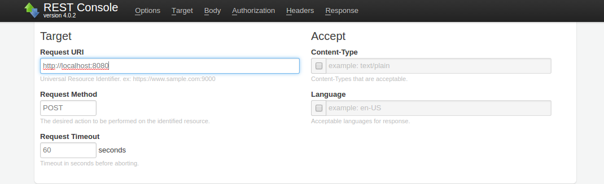
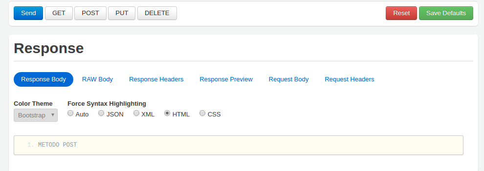
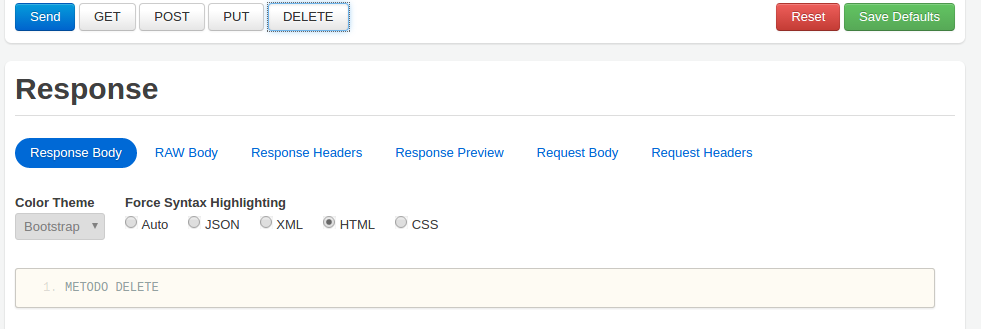

# Basic Routing
En el protocolo HTTP como bien sabemos existen diversos tipos de peticiones, como son GET, PUT, POST, DELETE, etc.
Con ExpressJS, tenemos la posibilidad de controlar las respuestas de nuestra aplicación en base al tipo de petición que se está tratando. El uso esquemático podría ser el siguiente:

```
app.METHOD(PATH, HANDLER)
```

* **app** es una instancia de Express
* **method** es el tipo de petición que estamos tratando
* **path** es la ruta que el cliente está solicitando
* **handler** es la función que se ejecutará

Para demostrar un básico uso de ExpressJS, levantaremos un servidor el cual responderá en base al tipo de petición HTTP que se le está haciendo:

```
app.get('/', function (req, res) {
  res.send('METODO GET');
  console.log(req.param('parametro')); //mostramos el valor del parámetro
})

app.post('/', function (req, res) {
  res.send('METODO POST');
})

app.put('/', function (req, res) {
  res.send('METODO PUT');
})

app.delete('/', function (req, res) {
  res.send('METODO DELETE');
})
```

El servidor anterior lo podremos hacer funcionar en el puerto **8080** mediante una tarea definida en el archivo **gulpfile.js**:

```
gulp basic-routing
```

Y mediante la herramienta nombrada al inicio (REST client), podremos ver el correcto funcionamiento de este simple servidor.

<div style="text-align:center"></div>

En este ejemplo indicamos la dirección a la que realizar la petición (en este caso localhost:8080), y en el tipo de método indicamos cuál queremos, por ejemplo **POST**.
Para verificar su correcto funcionamiento, dicha respuesta nos deberá dar un mensaje que nosotros hemos indicado para darnos cuenta de ello.

<div style="text-align:center"></div>

Como hemos podido observar, tras realizar una petición de tipo POST, la respuesta es la esperada, es decir, un mensaje de testeo "Metodo POST".

Para observar otro tipo de respuesta, éste sería el ejemplo para un tipo de petición **DELETE**:

<div style="text-align:center"></div>


Por último y como dato importante podríamos destacar las diversas maneras que existen de enviar datos al cliente:
* **send()**, **sendfile()**: Con este tipo de métodos, solo se pueden invocar una vez por cada petición, ya que tras su ejecución se cierra la solicitud. Como podemos entender, con estos métodos podemos desde enviar archivos, hasta código html en sus parámetros.
* **write()**: Al contrario que el anterior, éste método funciona de buffer, es decir, se puede usar las veces que uno desee, siempre y cuando se cierre la solicitud en el final con **end()**.
