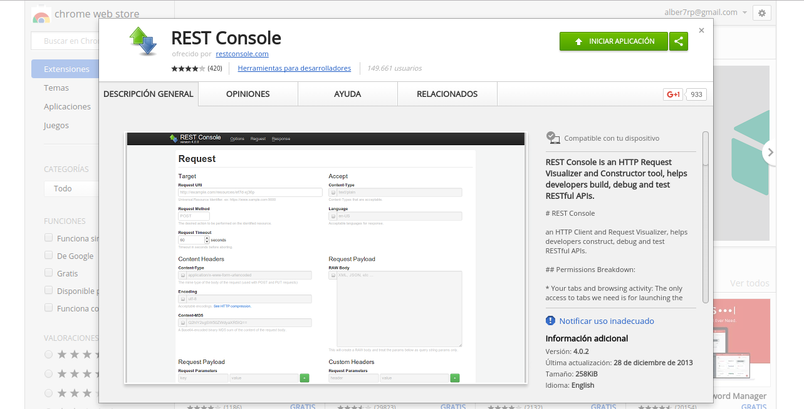

# ExpressJS

## ¿Qué es ExpressJS?
 Es un framework de aplicaciones web para Node.js , liberado como software libre y de código abierto bajo la licencia MIT . Está diseñado para la construcción de aplicaciones web y APIs .Es el hecho de infraestructura de servidor estándar para Node.js.

 Para la realización del estudio de rutas de dicho módulo, realizaremos una serie de tareas, en las que explicaremos las diferentes funcionalidades como también su ejecución.

 ## Herramientas
 Para probar la funcionalidad de nuestras aplicaciones en ExpressJS, tendremos que realizar diferentes tipos de peticiones HTTP, como pueden ser GET, POST, PUT o DELETE. Para ello haremos uso de una aplicación que nos facilitará gráficamente el proceso de testeo. Dicha aplicación se trata de una extensión de Google Chrome, la cual se puede descargar [aquí](https://chrome.google.com/webstore/detail/rest-console/cokgbflfommojglbmbpenpphppikmonn).

 

 En los siguientes capítulos podremos ver el funcionamiento de la herramienta.
