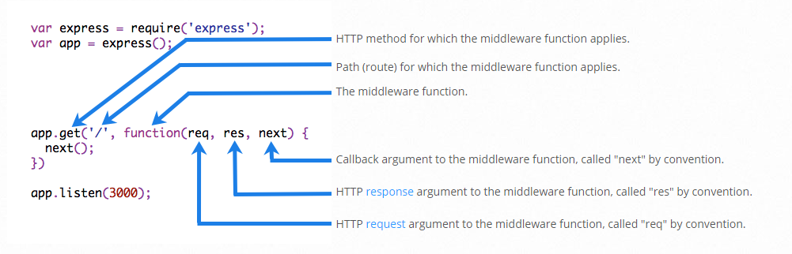
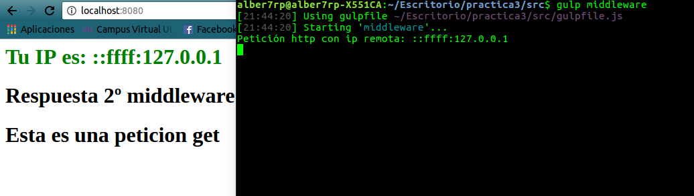
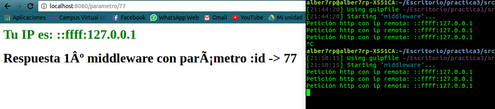
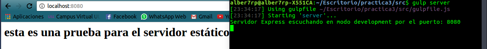

# Middleware

<div style="text-align:center"></div>

## ¿Qué es un middleware?
Las funciones de middleware son funciones que tienen acceso al objeto de solicitud (req), al objeto de respuesta (res) y a la siguiente función de middleware en el ciclo de solicitud/respuestas de la aplicación. La siguiente función de middleware se denota normalmente con una variable denominada next.

## ¿Qué puede hacer una función middleware?
* En su interior puede ejecutar cualquier tipo de código.
* Puede a su vez realizar cambios en la petición del cliente, como también en los objetos de respuesta.
* Puede finalizar el ciclo de solicitud/respuestas.
* Como es lógico, puede invocar al siguiente middleware de la pila.

De forma visual, una función middleware tiene el siguiente esquema:

<div style="text-align:center"></div>

Como se puede observar, tras la llegada de un request de un cliente, la petición pasa por una serie de funciones hasta llegar al "núcleo" de la aplicación, por dicho camino como hemos dicho, se pueden realizar multitud de operaciones, y es esa su gran funcionalidad.

Hay que recordar un dato muy importante a tener en cuenta, y es que obligatoriamente una función middleware o bien debe cerrar el ciclo de solicitud/respuesta o pasa el control a la siguiente función, ya que de no ser así la solicitud se quedará colgada.

Un ejemplo básico del manejo de funciones middleware podría ser el siguiente:

```
var app = require('express')();

app.use(function(req,res,next){
  var ip = req.headers['x-forwarded-for'] || req.connection.remoteAddress;
  console.log("Petición http con ip remota: " + ip);
  res.write('<h1 style="color:green"> Tu IP es: ' + ip + '</h1>');
  next();
});

app.all('/parametro/:id', function (req, res, next) {
  res.write('<h1> Respuesta 1º middleware con parámetro :id -> '+ req.params.id +' </h1>');
  res.end();
})

app.all('/', function (req, res, next) {
  res.write('<h1> Respuesta 2º middleware </h1>');
  next();
})

app.get('/', function (req, res, next) {
  res.write('<h1> Esta es una peticion get </h1>');
  res.end();
})

app.post('/', function (req, res, next) {
  res.write('<h1> Esta es una peticion post </h1>');
  res.end();
})

app.get('/hola', function (req, res, next) {
  res.write('<h1 style="color:red"> HOLA </h1>');
  res.end();
})

app.listen(8080);
```
Este ejemplo se puede hacer funcionar mediante la tarea **gulp middleware**, que levantará un servidor en el puerto **8080**.
Dicho ejemplo representa una serie de funciones middleware que pasan el control a su predecesora, en base al tipo de solicitud (ej: get, post,etc), como también a la ruta que nos pide el cliente (/, /hola, /:id).

Para mostrar su correcto funcionamiento tenemos las siguientes imágenes:

* <div style="text-align:center"></div>
En este ejemplo se trata de una petición de tipo **Get** cuya ruta es la inicial **/**, como se puede observar, dicha petición pasa por tres tipos de funciones middleware, en la que cada una envía diferentes datos al cliente. Cabe destacar la primera de ellas, en la que es accesible para todas las peticiones, la cual recoge la ip de origen y la muestra por pantalla.

* <div style="text-align:center"></div>
En este otro ejemplo vemos como podemos captar el paso de **parámetros** en la url del tipo **/parametro/:id**, en la que :id se refiere al valor del parámetro.


## Formas de declarar una función middleware
Como hemos podido ver en el ejemplo anterior, se han definido funciones middleware de distintas formas, de cierta manera diríamos que existen 2 formas de realizarlo:

* ```
app.use(function(req,res,next){
  next();
});
```
En éste caso se utiliza el método **use**, en el que se le pasa una función por parámetro. Con ésta manera estaríamos diciendo que dicha función middleware que se ha pasado por parámetro se debe ejecutar siempre que llega una petición de cualquier tipo.


* ```
app.get('/filtro', function(req,res,next){
  next();
});
```
En este último caso en vez de utilizar el método use, se estaría empleando un filtro según el tipo de petición, es decir, dicha función que se ha pasado por parámetro, en este caso solamente se ejecutara cuando las peticiones sean de tipo **Get** y cuya ruta sea la indicada, **/filtro**.


## Middleware a nivel de direccionador
En este caso, se estaría hablando de manera similiar al middleware anterior, el único cambio es que se utiliza una diferente instancia para su ejecución, veamoslo en el siguiente ejemplo:

```
var app = require('express')();
var router = require('express').Router();

// a middleware function with no mount path. This code is executed for every request to the router
router.use(function (req, res, next) {
  console.log('Time:', Date.now());
  next();
});

```
En el caso anterior, se utilizaría la instancia de **Router()**, en particular la función declarada se ejecutaría siempre tras cada solicitud, en la que se indica la fecha en la que se realizó.


## Middleware manejadores de errores
Como bien indica el titulo, también se pueden definir funciones que manejan los errores que ocurren en la web, como por ejemplo el **error 500**, que indica un error interno del servidor:
```
app.use(function(err, req, res, next) {
  res.status(500).send('Algo no ha ido bien!');
});
```
Como hemos podido ver, las funciones que manejan errores incluyen otro parámetro, **err**, que indica el error que se está tratando.
Se debe comentar que hay errores que express no puede detectar, como por ejemplo el **error 404**, este comportamiento se debe a que una respuesta 404 simplemente indica la ausencia de trabajo adicional pendiente; es decir, Express ha ejecutado todas las rutas y funciones de middleware, y ha comprobado que ninguna de ellas responde. Lo único que debe hacer es añadir una función de middleware al final de la pila (debajo de las demás funciones) para manejar una respuesta 404:

```
app.use(function(req, res, next) {
  res.status(404).send('Sorry cant find that!');
});
```
Se coloca al final de la pila, ya que los middleware se ejecutarán en el orden en el que se han definido, por lo que la función anterior solo se ejecutará en el caso de que las anteriores no lo hagan.


## Middleware incorporado
Express dispone de forma propia de un middleware, se trata de **Express.static**, cuya función tiene la finalidad de servir estáticamente las peticiones que el cliente pida (**gulp server**):

```
var app = express();

app.use(express.static(path.resolve('middleware/html'))); //ponemos ruta por defecto relativa
```

<div style="text-align:center"></div>
