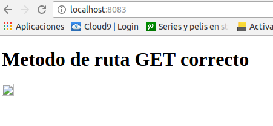
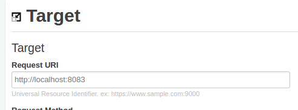
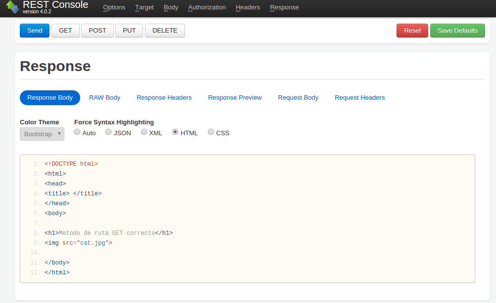
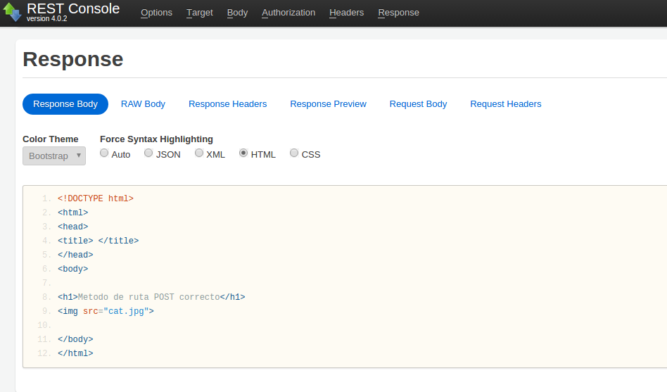
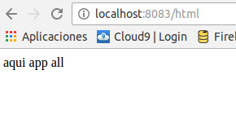
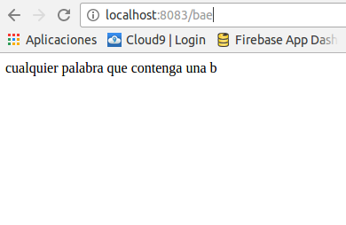

# Direccionamiento en Express
El direccionamiento hace referencia a la determinación de cómo responde una aplicación a una solicitud de cliente en un determinado punto final, que es un URI (o una vía de acceso) y un método de solicitud HTTP específico (GET, POST, etc.).

## Métodos de ruta
Se derivan de uno de los métodos HTTP y se adjuntan a una instancia de la clase express.

Como se puede observar en la carpeta **/src** hemos definido un ejemplo **routing.js** ilustrando el uso del método GET y POST. A continuación mostramos unas capturas de su funcionamiento:

* En primer lugar lanzamos el servidor en nuestra máquina local, siendo visible en el puerto 8083 escribiendo en nuestro navegador
```
localhost:8083
```
<div style="text-align:center"></div>

Para poder diferenciar las diferentes peticiones como GET o POST y poder corroborar que estas están funcionando correctamente, utilizamos una herramienta que nos permitirá visualizar el resultado de GET, POST... o el método definido.

* Primero escribimos la dirección de nuestro servidor:


<div style="text-align:center"></div>
<br>

* Para GET:
```
app.get('/', function (req, res) {
  res.sendfile(__dirname + '/html/get.html');
});
```
<div style="text-align:center"></div>
<br>
* Para POST:
```
app.post('/', function (req, res) {
  res.sendfile(__dirname + '/html/post.html');
});
```

<div style="text-align:center"></div>
<br>

Ambas peticiones nos llevan a un archivo .html distinto como se ve en las imágenes, así lo definimos en nuestro routing.js.

* **app.all:**  Este método se utiliza para cargar funciones de middleware en una vía de acceso para todos los métodos de solicitud.
```
app.all('/app', function (req, res, next) {
  console.log('siguiente');
  next(); // pass control to the next handler
});
//Esta vía de acceso de ruta coincidirá con las solicitudes a la ruta /html
app.get('/html', function (req, res) {
  res.send('aqui app all');
});
```
<div style="text-align:center"></div>
<br>
* Hacemos uso de res.sendfile:
```
res.sendfile(__dirname + '/html/post.html');
```
con esto conseguimos dirigir la respuesta hacia un archivo concreto en un directorio concreto, en este caso /html/post.html

## Vias de acceso de rutas

Las vias de acceso de rutas definen los puntos finales donde pueden realizarse solicitudes, en nuestro caso vamos a definir un patrón en el cual el cliente solicitará una palabra que contenga la letra **b**  

```
app.get(/b/, function(req, res) {
  res.send('cualquier palabra que contenga una b');
});

```

<div style="text-align:center"></div>
<br>

## Manejadores de rutas
Puede proporcionar varias funciones de devolución de llamada que se comportan como middleware para manejar una solicitud. La única excepción es que estas devoluciones de llamada pueden invocar next('route') para omitir el resto de las devoluciones de llamada de ruta. Puede utilizar este mecanismo para imponer condiciones previas en una ruta y, a continuación, pasar el control a las rutas posteriores si no hay motivo para continuar con la ruta actual.

 
```
app.get('/html/b', function (req, res, next) {
  console.log('la siguiente funcion tiene la respuesta');
  next();
}, function (req, res) {
  res.send('<h1> dentro de b </h1>');
});
```
